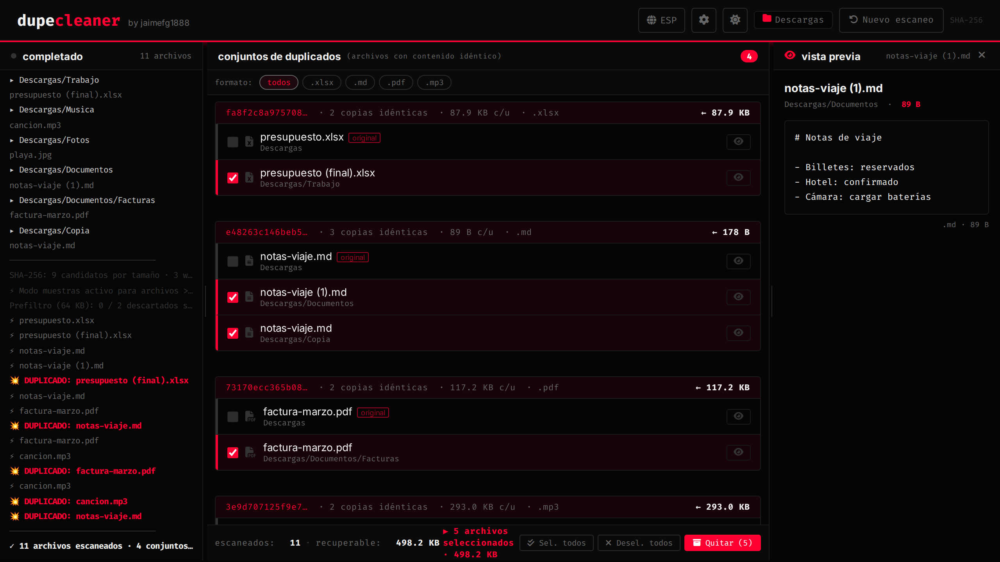

# 🔍 DupeCleaner

[English](#-english) · [Español](#-español)



---

## 🇬🇧 English

Browser-based duplicate file finder. No server, no uploads, no third-party requests — everything runs locally in your browser. Pick a folder: the app scans it recursively, groups files with identical content using SHA-256 and lets you review them and **move the copies to a quarantine folder** (or delete them, if you explicitly choose so).

- **Live:** <https://jaimefgdev.github.io/dupecleaner/>
- **Source:** <https://github.com/jaimefgdev/dupecleaner>

### Safety first

DupeCleaner removes files, so it is built to never remove the wrong one:

- **Quarantine by default.** Copies are moved to `_dupecleaner_cuarentena/` inside the scanned folder, keeping their original path, so you can review and restore them. Quarantine is never scanned again. Permanent deletion is an explicit option that requires typing `CONFIRM`.
- **Full verification right before touching anything.** Each copy and its original are re-read and compared with the **full** SHA-256, and their size and modification date must not have changed since the scan. If anything differs, the file is left alone and the log says why.
- **The original is always kept.** The first file of every set (in scan order) cannot be selected, not even by forcing the checkbox.
- **Fast mode is honest.** Files over 20 MB are compared by samples (start, middle, end) in fast mode; those sets are marked **probable** and are always fully verified before removal.

### Features

- WebAssembly SHA-256 ([hash-wasm](https://github.com/Daninet/hash-wasm)) in a pool of Web Workers — the UI never freezes
- Size pre-filter plus a 64 KB prefix pre-filter: most non-duplicates are discarded without reading them fully
- Stop a scan at any time, even in the middle of a multi-GB file
- Smart skipping: OS folders are only skipped when you pick a drive root; recycle bins and indexes are always skipped; development and hidden folders are optional. Every skipped folder is shown in the log with its reason
- Read errors are listed in the log and counted, the scan always finishes
- Preview for images, text/code, PDF, video and audio
- Format filter chips, virtual list for thousands of sets
- Spanish / English, dark / light theme; language, theme and scan options are remembered
- Installable PWA that works offline after the first visit
- Accessible: keyboard-only use, focus-trapped dialogs, screen-reader labels
- Strict Content-Security-Policy; fonts and icons are self-hosted

### Browser support

| Browser | Scan | Move to quarantine / delete |
|---|---|---|
| Chrome / Edge 102+ (desktop, Android) | ✅ | ✅ |
| Firefox, Safari | ✅ | ❌ (no File System Access API) |

### Run it locally

The app uses ES modules and module Workers, so it must be served over HTTP (opening `index.html` from disk does not work). No build step:

```
npm run serve          # http://localhost:8080/
# or any static server, e.g.: python3 -m http.server 8080
```

### How it works

1. **Collect** — walk the folder with the File System Access API (or `<input webkitdirectory>` on Firefox/Safari), applying the skip rules.
2. **Group by size** — only files with the same size can be identical.
3. **Prefix pre-filter** — for files over 128 KB, hash the first 64 KB; only matching files continue.
4. **Hash** — full SHA-256 (or three 2 MB samples for files over 20 MB in fast mode) in a worker pool.
5. **Review** — sets appear as they are found; select copies and remove them.
6. **Verify and remove** — full re-hash of original and copy, then move to quarantine or delete.

### Tests

```
npm ci
npx playwright install chromium
npm run lint        # ESLint + Stylelint
npm test            # unit tests (node:test) + end-to-end tests (Playwright)
npm run test:perf   # performance test: previous engine vs current one
```

End-to-end tests only use **OPFS** (the browser's private storage, empty for every test) or temporary folders created and deleted by the test itself. They never open or touch real folders. CI runs lint and every test on each pull request.

### Project structure

```
index.html              markup (no inline scripts or styles)
styles.css              styles
sw.js                   service worker (offline)
manifest.webmanifest    PWA manifest
icons/                  app icons (scripts/make-icons.mjs)
src/
  app.js                UI
  sha256.js             hashing strategies (+ pure JS SHA-256 fallback)
  wasm-sha256.js        WebAssembly SHA-256 loader
  hash-worker.js        hashing Web Worker
  hasher.js             worker pool with cancellation and timeouts
  dupe-index.js         files and duplicate sets
  safety.js             what can be removed and pre-removal verification
  quarantine.js         move to quarantine / delete
  filters.js            skip rules and stored options
  format.js             escaping and formatting helpers
  virtual-scroller.js   virtual list
vendor/                 self-hosted third-party files (scripts/vendor.mjs)
scripts/                dev server, vendoring, icons, screenshot, site build
test/unit|e2e|perf      tests
```

### Deploy to GitHub Pages

`.github/workflows/pages.yml` deploys on every push to `main`, **only if lint and all tests pass**. One-time setup: **Settings → Pages → Build and deployment → Source: GitHub Actions**.

### License

[MIT](LICENSE). Third-party files in `vendor/` keep their own licenses: hash-wasm (MIT), Font Awesome Free (icons CC BY 4.0, font SIL OFL 1.1, CSS MIT), Inter and Fira Code (SIL OFL 1.1).

---

## 🇪🇸 Español

Buscador de archivos duplicados que funciona en el navegador. Sin servidor, sin subidas y sin peticiones a terceros: todo ocurre en tu equipo. Elige una carpeta: la app la recorre entera, agrupa los archivos con contenido idéntico usando SHA-256 y te deja revisarlos y **mover las copias a una carpeta de cuarentena** (o borrarlas, si lo eliges de forma explícita).

- **En línea:** <https://jaimefgdev.github.io/dupecleaner/>
- **Código:** <https://github.com/jaimefgdev/dupecleaner>

### La seguridad, lo primero

DupeCleaner quita archivos, así que está hecho para no quitar nunca el que no toca:

- **Cuarentena por defecto.** Las copias se mueven a `_dupecleaner_cuarentena/` dentro de la carpeta escaneada, conservando su ruta, para que puedas revisarlas y restaurarlas. La cuarentena nunca se vuelve a escanear. El borrado definitivo es una opción explícita que exige escribir `CONFIRMAR`.
- **Verificación completa justo antes de tocar nada.** Cada copia y su original se vuelven a leer y se comparan con el SHA-256 **completo**, y su tamaño y fecha no pueden haber cambiado desde el escaneo. Si algo no cuadra, el archivo no se toca y el registro explica por qué.
- **El original siempre se conserva.** El primer archivo de cada conjunto (en orden de escaneo) no se puede seleccionar, ni forzando la casilla.
- **El modo rápido no engaña.** En modo rápido, los archivos de más de 20 MB se comparan por muestras (inicio, centro y final); esos conjuntos se marcan como **probables** y siempre se verifican completos antes de quitarlos.

### Características

- SHA-256 en WebAssembly ([hash-wasm](https://github.com/Daninet/hash-wasm)) en un pool de Web Workers: la interfaz nunca se congela
- Prefiltro por tamaño y por los primeros 64 KB: la mayoría de archivos distintos se descartan sin leerlos enteros
- Puedes detener el escaneo en cualquier momento, incluso a mitad de un archivo de varios GB
- Omisiones con criterio: las carpetas del sistema solo se omiten si eliges la raíz de un disco; papeleras e índices siempre; carpetas de desarrollo y ocultas, opcionales. Cada carpeta omitida aparece en el registro con su motivo
- Los errores de lectura se listan y se cuentan; el escaneo siempre termina
- Vista previa de imágenes, texto/código, PDF, vídeo y audio
- Filtro por formato y lista virtual para miles de conjuntos
- Español / inglés, tema oscuro / claro; idioma, tema y opciones se recuerdan
- PWA instalable que funciona sin conexión tras la primera visita
- Accesible: uso completo con teclado, diálogos con el foco atrapado, etiquetas para lectores de pantalla
- Content-Security-Policy estricta; fuentes e iconos alojados en el propio sitio

### Navegadores

| Navegador | Escanear | Mover a cuarentena / borrar |
|---|---|---|
| Chrome / Edge 102+ (escritorio, Android) | ✅ | ✅ |
| Firefox, Safari | ✅ | ❌ (sin File System Access API) |

### Ejecutar en local

La app usa módulos ES y Workers de módulo, así que hay que servirla por HTTP (abrir `index.html` desde el disco no funciona). No hay paso de build:

```
npm run serve          # http://localhost:8080/
# o cualquier servidor estático, p. ej.: python3 -m http.server 8080
```

### Cómo funciona

1. **Recopilar**: recorre la carpeta con la File System Access API (o `<input webkitdirectory>` en Firefox/Safari) aplicando las reglas de omisión.
2. **Agrupar por tamaño**: solo pueden ser idénticos archivos del mismo tamaño.
3. **Prefiltro**: en archivos de más de 128 KB se calcula el hash de los primeros 64 KB; solo siguen los que coinciden.
4. **Hash**: SHA-256 completo (o tres muestras de 2 MB para archivos de más de 20 MB en modo rápido) en el pool de workers.
5. **Revisar**: los conjuntos aparecen según se encuentran; seleccionas las copias y las quitas.
6. **Verificar y quitar**: nuevo hash completo del original y de la copia, y después cuarentena o borrado.

### Pruebas

```
npm ci
npx playwright install chromium
npm run lint        # ESLint + Stylelint
npm test            # pruebas unitarias (node:test) + end-to-end (Playwright)
npm run test:perf   # prueba de rendimiento: motor anterior frente al actual
```

Las pruebas end-to-end solo usan **OPFS** (almacenamiento privado del navegador, vacío en cada prueba) o carpetas temporales que la propia prueba crea y borra. Nunca abren ni tocan carpetas reales. El CI ejecuta lint y todas las pruebas en cada pull request.

### Estructura del proyecto

Ver la sección en inglés: los nombres de archivo son los mismos.

### Despliegue en GitHub Pages

`.github/workflows/pages.yml` despliega en cada push a `main`, **solo si pasan el lint y todas las pruebas**. Configuración única: **Settings → Pages → Build and deployment → Source: GitHub Actions**.

### Licencia

[MIT](LICENSE). Los archivos de terceros en `vendor/` mantienen sus licencias: hash-wasm (MIT), Font Awesome Free (iconos CC BY 4.0, fuente SIL OFL 1.1, CSS MIT), Inter y Fira Code (SIL OFL 1.1).
